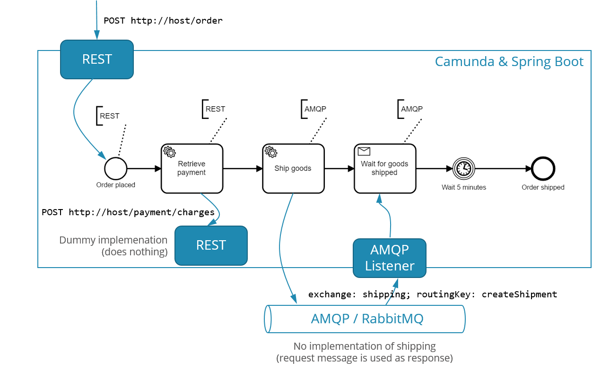
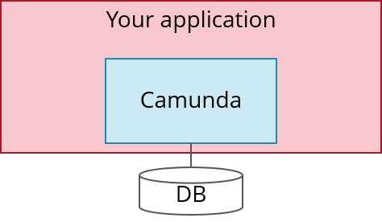
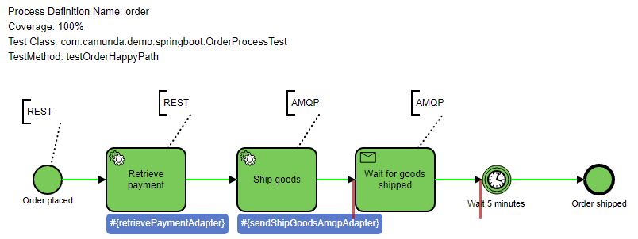
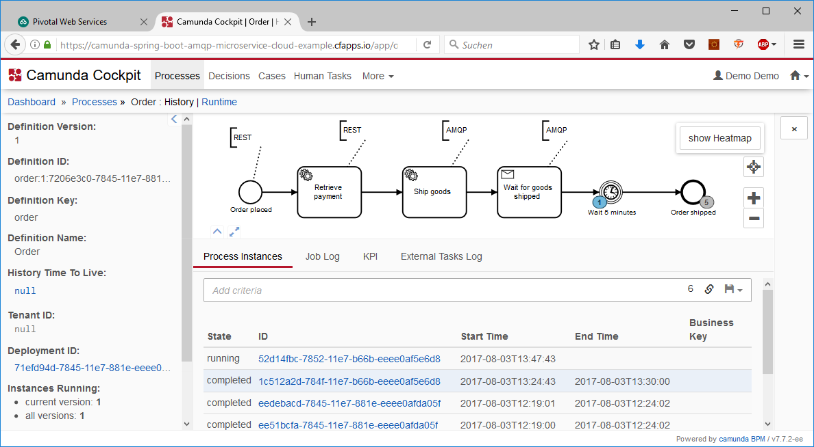
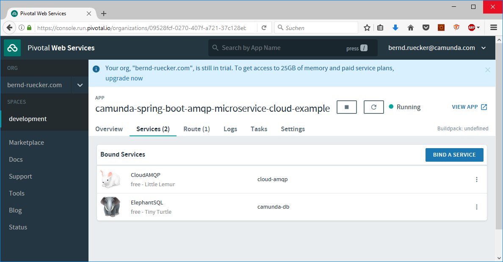
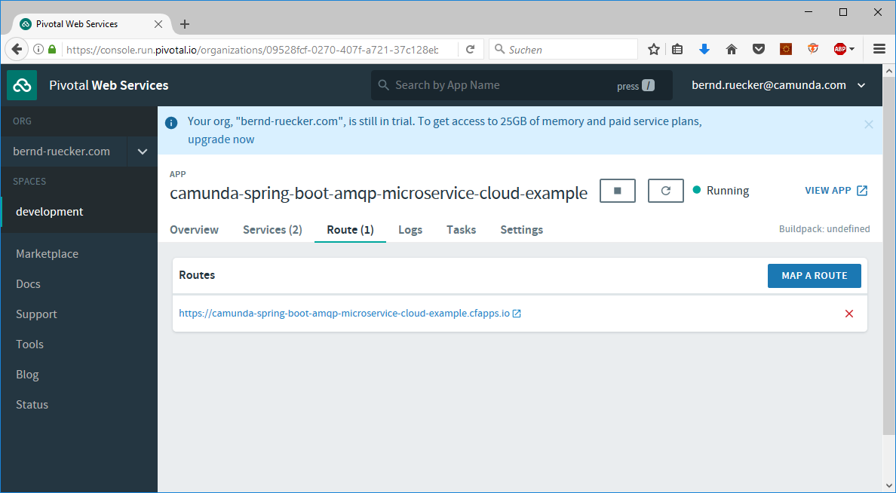

# Camunda Spring Boot example including REST and AMQP, automated tested and deployable in the cloud

This example shows:

- How to setup Camunda, Spring Boot and various test frameworks correctly in order to work. It can be used as a copy & paste template.
- How to use AMQP and REST in your processes the Spring way.
- How to write proper scenario tests, that test if your process impacts the outer world as you expect (and not tests that Camunda did write a proper workflow engine).
- How this type of application can be easily deployed in the cloud (Pivotal Web Services as an example).

The business example is a very simple order fullfillment microservice (motivated by [the flowing retail example](https://blog.bernd-ruecker.com/flowing-retail-demonstrating-aspects-of-microservices-events-and-their-flow-with-concrete-source-7f3abdd40e53)):



- It is triggered via REST (it could have been an AMQP message or any other trigger as well, just REST is very easy to do demo requests)
- Calls a REST service (actually, the REST service is directly implemented here for simplicity, as I did not want to rely on an external URL)
- Sends a AMQP message and waits for a response. For simplicity, the request message will be directly treated as response

# Embedded engine

With Camunda it is possible to run the engine as part of your application or microservice. This is called [embedded engine](https://docs.camunda.org/manual/latest/introduction/architecture/#embedded-process-engine). This is especially helpful in microservice architectures if you develop in Java, then the engine simply gets a library helping you to define flows with persistent state and subsequent requirements like timeout handling, retrying, compensation and so on. See [Why service collaboration needs choreography AND orchestration](https://blog.bernd-ruecker.com/why-service-collaboration-needs-choreography-and-orchestration-239c4f9700fa) for background reading.



# Walkthorugh as screencast

This video gives a very quick walk through the example (15 minutes):

<a href="http://www.youtube.com/watch?feature=player_embedded&v=XimowIZLWD8" target="_blank"></a>

# Project setup

The project uses

- Spring Boot
- Camunda
- [camunda-bpm-spring-boot-starter](https://github.com/camunda/camunda-bpm-spring-boot-starter/)
- [camunda-bpm-assert-scenario](https://github.com/camunda/camunda-bpm-assert-scenario/)
- [camunda-bpm-assert](https://github.com/camunda/camunda-bpm-assert/)
- [camunda-bpm-process-test-coverage](https://github.com/camunda/camunda-bpm-process-test-coverage/)
- H2 for testing (in-memory) and running it locally (file based)
- PostgreSQL/ElephantDB as cloud storage on Pivotal Web Services

Please have a look at the [pom.xml](pom.xml) for details. Also note the [Application.java](src/main/java/com/camunda/demo/springboot/Application.java) as Spring Boot starter class.


# Configuration of Camunda

With Spring Boot Camunda gets auto-configured using defaults. You can easily change the configuration by providing classes according to the [docs](https://camunda.github.io/camunda-bpm-spring-boot-starter/docs/2.1.2/index.html#_process_engine_configuration). In this example you can see

- [HistoryConfiguration](src/main/java/com/camunda/demo/springboot/conf/CamundaEngineHistoryConfiguration.java) that tells Camunda to save all historic data and audit logs.
- [IdGenerator](src/main/java/com/camunda/demo/springboot/conf/CamundaIdGeneratorConfiguration.java) so that Camunda uses string UUID's instead of database generated ones, which avoids deadlock risks in cluster environments.
- [Plugin to write some events to sysout](src/main/java/com/camunda/demo/springboot/conf/plugin/SendEventListener). This plugin registers a listener to get notified when new workflow instances are started or existing ones are eneded. In this codebase just prints a line on the console, but it would be easy to push the event to some central tracing system. The cool thing: Such a plugin could be packaged in an own Maven depedency, as soon it is on the classpath it will be activated and influence the core engine. 


# Using Camunda Enterprise Edition

The example uses the community edition to allow for a quick start. It is easy to switch dependencies to use the Enterprise Edition as you can see in [this commit](commit/724e3db5f09f1743445c78d84e28d2fa5c0b6005). Just make sure you can connect to the [Camunda Nexus](https://docs.camunda.org/get-started/apache-maven/#camunda-nexus) using your enterprise credentials.

# Testing

One extremly interessting piece is the JUnit test case, which does a complete run-thorugh the process, including all Java code attached to the process, but without sending any real AMQP message or REST request. The timeout of a waiting period in the process is also simulated. 

```java
    StartingByStarter starter = Scenario.run(orderProcess) //
      .startBy(() -> {
        return orderRestController.placeOrder(orderId, 547);
      });
    
    // expect the charge for retrieving payments to be created correctly and return a dummy transactionId
    mockRestServer
        .expect(requestTo("http://api.example.org:80/payment/charges")) //
        .andExpect(method(HttpMethod.POST))
        .andExpect(jsonPath("amount").value("547"))
        .andRespond(withSuccess("{\"transactionId\": \"12345\"}", MediaType.APPLICATION_JSON));
    
    when(orderProcess.waitsAtReceiveTask("ReceiveTask_WaitForGoodsShipped")).thenReturn((messageSubscription) -> {
      amqpReceiver.handleGoodsShippedEvent(orderId, "0815");
    });    

    when(orderProcess.waitsAtTimerIntermediateEvent(anyString())).thenReturn((processInstance) -> {
      processInstance.defer("PT10M", () -> {fail("Timer should have fired in the meanwhile");}); 
    });
    
    // OK - everything prepared - let's go
    Scenario scenario = starter.execute();
    
    mockRestServer.verify();

    // and very that some things happened
    assertThat(scenario.instance(orderProcess)).variables().containsEntry(ProcessConstants.VARIABLE_paymentTransactionId, "12345");
    assertThat(scenario.instance(orderProcess)).variables().containsEntry(ProcessConstants.VAR_NAME_shipmentId, "0815");

    {
      ArgumentCaptor<Message> argument = ArgumentCaptor.forClass(Message.class);
      verify(rabbitTemplate, times(1)).convertAndSend(eq("shipping"), eq("createShipment"), argument.capture());
      assertEquals(orderId, argument.getValue());
    }

    verify(orderProcess).hasFinished("EndEvent_OrderShipped");
```

Refer to the [OrderProcessTest.java](src/main/java/com/camunda/demo/springboot/OrderProcessTest.java) for all details. Note that the test generates a graphical report:




# Get started

In order to get started just

* Clone or download this example
* Maven build (this also runs the test cases)
```shell
mvn clean install
```

* Install [RabbitMQ](http://rabbitmq.com/) and start it up

* Run microservice via Java:
```shell
java -jar target/camunda-spring-boot-amqp-microservice-cloud-example-0.0.1-SNAPSHOT.jar
```

Now you can access:

* [Camunda web applications](http://localhost:8080/)
* [REST API for new orders](http://localhost:8080/orders)
* [RabbitMQ Management Console](http://localhost:15672/)

Of course you can also use your favorite IDE.


# Cloud deployment on Pivotal Web Services

You can easily deploy a Spring Boot application to various cloud providers, as you get a fat jar runnable on every JVM. 

And using the [Spring Cloud Connectors](http://cloud.spring.io/spring-cloud-connectors/) the application can be magically wired with cloud resources. 

The example I show here is:
* Deployment on [Pivotal Web Services](https://run.pivotal.io/)
* [ElephantSQL](https://www.elephantsql.com/) as hosted PostgreSQL, started as Service named ```camunda-db```
* [CloudAMPQ](https://www.cloudamqp.com/) as hosted RabbitMQ - started as Service ```cloud-amqp```

All metadata for the deployment are described in the [manifest.yml](manifest.yml):

```
---
applications:
  - name: camunda-spring-boot-amqp-microservice-cloud-example
    memory: 1G
    instances: 1
    random-route: false

services:
  - cloud-amqp
  - camunda-db
```

Now you can easily deploy the application using the [CloudFoundry CLI](https://docs.cloudfoundry.org/cf-cli/). After logging in you can simply type:

```
mvn clean install && cf push -p target/camunda-spring-boot-amqp-microservice-cloud-example-0.0.1-SNAPSHOT.jar
```

There it is, now you can start a process:

```shell
url -X POST -F 'orderId=123' -F 'amount=4990' http://camunda-spring-boot-amqp-microservice-cloud-example.cfapps.io/order
```

And will see it in cockpit:



The URL to access the Camunda web applications and your REST-API depends on various factors, but will be shown via the Pivotal console:




